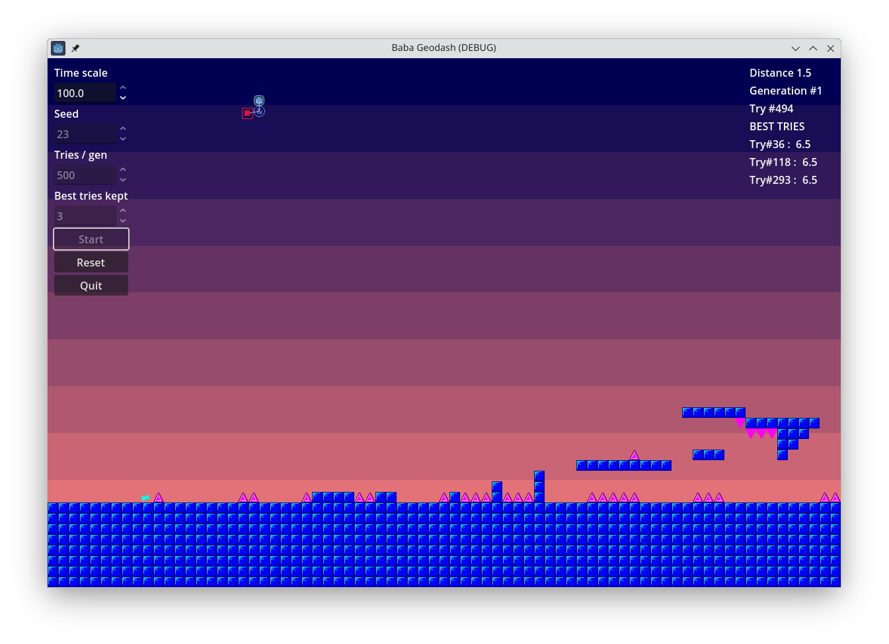

# Baba - Geodash

This project explores a way to implement portals (like the famous [Valve's Portal game](https://en.wikipedia.org/wiki/Portal_(video_game))) in Godot.



This has been inspired by [the video "J'apprends un IA à jouer à Geo Dash](https://www.youtube.com/watch?v=MTcXW94V838) by [Code BH](https://www.youtube.com/@codebh).

## About

The algorithm controls the player by adding detectors:
- **Spike detector**
- **Wall detector**

A detector activates when its target is detected (green square) or when absent (red square). Detectors are connected via connectors (blue circles), which combine their linked detectors using Boolean AND (`&`) or OR (`|`) operators.

The first generation creates purely random detector configurations, each with a single connector linked to one detector. Both the connector's position and operator are randomized.

The detector’s position, target, and reverse mode are also randomized. Once a configuration is generated, the game is launched. When the set number of configurations per generation is reached, the best attempts are kept, measured by the distance traveled from the start of the level.

The next generation evolves from the best configurations of the previous generation, applying random modifications to connectors or detectors:
- Change position
- Change operator
- Toggle reverse mode
- Add or remove a connector/detector

This process repeats, continually evolving better solutions.

## Features

Before starting the simulation, you can set the following parameters:
- Seed for the random number generator (RNG)
- Number of attempts per generation
- Number of best attempts retained per generation

If a solution is found, it is replayed indefinitely at normal speed.

## Getting Started

### Prerequisites

- [Godot Engine 4.4](https://godotengine.org/download)

### Installation

1. **Clone the repository:**

    ```
    git clone https://github.com/peebam/baba-geodash
    ```

2. **Open the project in Godot Engine 4.4.**

3. **Run the project.**
